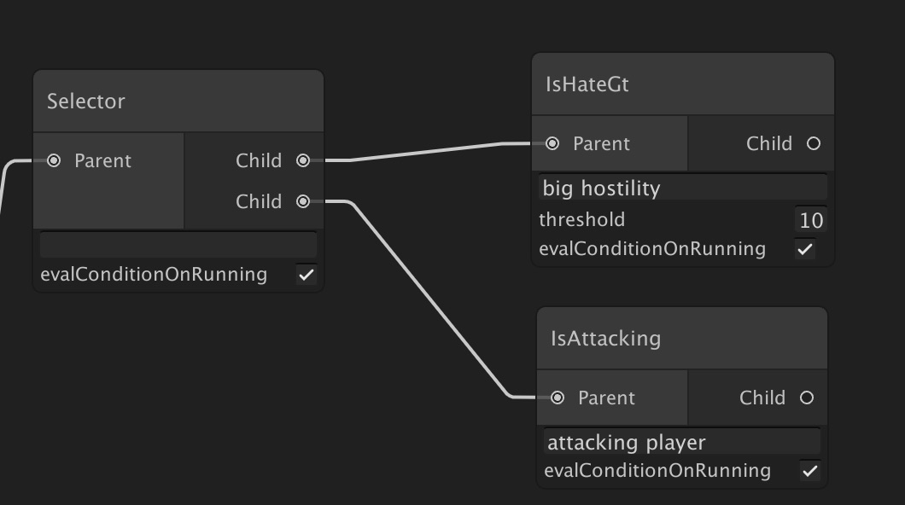
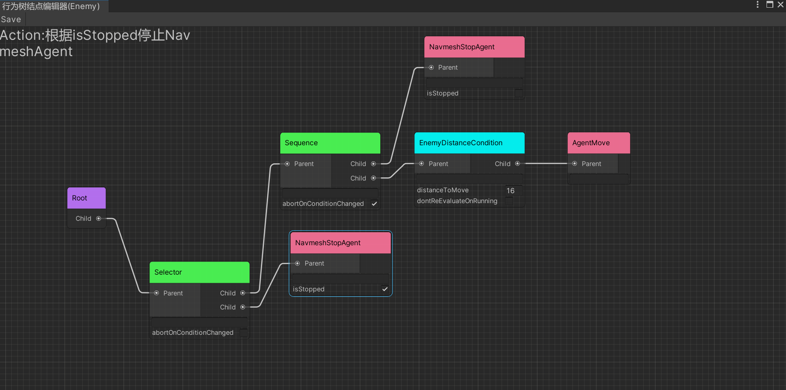
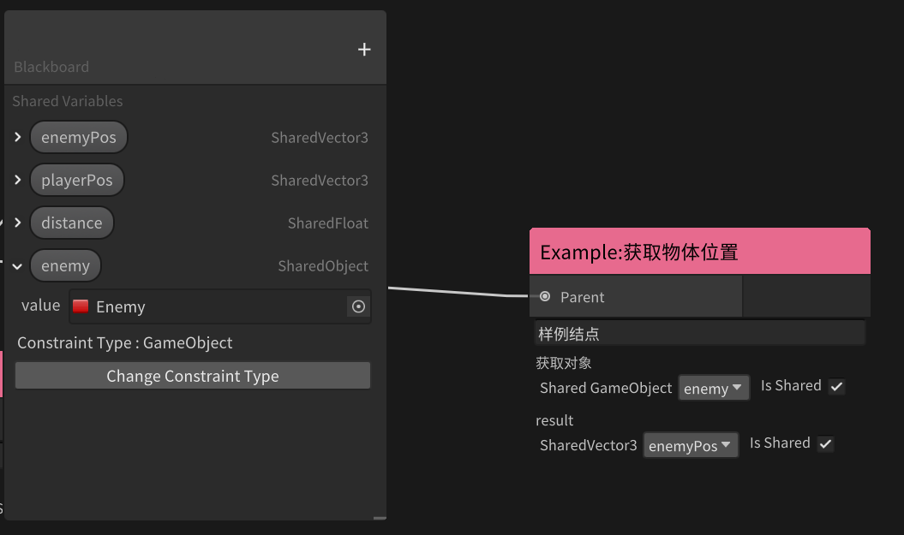

# API
  - [Behavior Node Type](#behavior-node-type)
  - [Built In Composite Node](#built-in-composite-node)
    - [Sequence](#sequence)
    - [Selector](#selector)
    - [Parallel](#parallel)
    - [Random](#random)
    - [Rotator](#rotator)
  - [Create New Behaviors](#create-new-behaviors)
    - [Create Action](#create-action)
    - [Create Conditional](#create-conditional)
    - [Create Composite](#create-composite)
    - [Create Decorator](#create-decorator)
  - [Attributes](#attributes)
    - [AkiInfoAttribute](#akiinfoattribute)
    - [AkiLabelAttribute](#akilabelattribute)
    - [AkiGroupAttribute](#akigroupattribute)
    - [ForceSharedAttribute](#forcesharedattribute)
    - [WrapFieldAttribute](#wrapfieldattribute)
  - [SharedVariable](#sharedvariable)
    - [How to use](#how-to-use)
    - [API Reference](#api-reference)


## Behavior Node Type

| Name             | Description                                                                                                                                         |
| ---------------- | --------------------------------------------------------------------------------------------------------------------------------------------------- |
| Composite Node   | It has one or more child nodes and controls which child node to update.                                                                             |
| Action Node      | This is the leaf node. It execute action such as follow player, attack, escape or others you define.                                                |
| Conditional Node | It has one child node and check the condition whether child is updatable. when having no child, Conditional Node is the leaf node like Action Node. |
| Decorator Node   | It has one child node and will modify the return value according to the return value of the child node                                              |

| Name              | Description                                                               |
| ----------------- | ------------------------------------------------------------------------- |
| evaluateOnRunning | true : evaluate the condition if the previous status is `Status.Running`. |

## Built In Composite Node

I have prepared several built in Composite Node.

### Sequence
* Updates the child nodes in order from the top. 
* Returns failure immediately if the child node returns failure. 
* Returns running immediately and calls the child at the next update timing if the child node returns running.
* Returns success if all child nodes return success.  

Sequence has following parameter.

| Name                    | Description                                                                                                                                                                                                                                                      |
| ----------------------- | ---------------------------------------------------------------------------------------------------------------------------------------------------------------------------------------------------------------------------------------------------------------- |
| abortOnConditionChanged | true: Aborts the running node when a node with a higher priority than the running node becomes infeasible. Specifically, the execution result of `Conditional.CanUpdate`, which is a descendant of a node with a higher priority than the running node, is used. |

### Selector
* Updates the child nodes in order from the top. 
* Returns success immediately if the child node returns success. 
* Returns running immediately and calls the child at the next update timing if the child node returns running.
* Returns failure if all child nodes return failure.  

Selector has following parameter.

| Name                    | Description                                                                                                                                                                                                                                                      |
| ----------------------- | ---------------------------------------------------------------------------------------------------------------------------------------------------------------------------------------------------------------------------------------------------------------- |
| abortOnConditionChanged | true: Aborts the running node when a node with a higher priority than the running node becomes executable. Specifically, the execution result of `Conditional.CanUpdate`, which is a descendant of a node with a higher priority than the running node, is used. |

### Parallel
* Updates all child nodes.
* Returns running if any child node returns running.
* Returns failure if any child node returns failure.
* Otherwise, returns success.

### Random
* The child nodes are elected and executed according to the probability based on the uniform distribution.  
* Select one for each update. However, if the running status is returned during the last update, the node will continue to run.

### Rotator
* Updates the child nodes in order. Unlike Sequencer, one child node is executed by one update instead of executing all child nodes by one update.  
* For example, if there are three child nodes, the first Update will execute the top node, the next Update will execute the second node, and the next Update will execute the third node.  
* The next run will run the top node again.  
* If a child node returns a running state, it exits without executing subsequent child nodes, and the child node continues to run on the next update.

Rotator has following parameter.

| Name         | Description                                                                                                                                                                           |
| ------------ | ------------------------------------------------------------------------------------------------------------------------------------------------------------------------------------- |
| resetOnAbort | It is a flag whether to return the next execution target node from the top when the execution condition of the ancestor Conditional Node changes and the running node is interrupted. |


## Create New Behaviors

### Create Action
* Create C# Script and extends `AkiBT.Action`
* Override `OnUpdate` and return status(Success/Running/Failure).
* Override `Awake` called by `AkiBT.BehaviorTree.Awake` if needed.
* Override `Start` called by `AkiBT.BehaviorTree.Start` if needed.
* Override `Abort` to reset field or any state when the parent condition changed..
* Action has Node `gameObject` field with `AkiBT.BehaviorTree` attached.
* Private [SerializeField] field and public field can be set on Behavior Tree editor window.

```c#
public class Wait : Action
{
    [SerializeField] 
    private float waitTime;

    private float elapsedTime = 0.0f;

    protected override Status OnUpdate()
    {
        elapsedTime += Time.deltaTime;
        if (elapsedTime < waitTime)
        {
            return Status.Running;
        }

        elapsedTime = 0.0f;
        return Status.Success;
    }

    // abort when the parent conditional changed on previous status is running.
    public override void Abort()
    { 
        elapsedTime = 0.0f;
    }
}
```

### Create Conditional
* Create C# Script and extends `AkiBT.Conditional`
* Override `IsUpdatable` and return result(true/false). when `IsUpdatable` returns update child.
* Override `OnAwake` called by `AkiBT.BehaviorTree.Awake` if needed.
* Override `OnStart` called by `AkiBT.BehaviorTree.Start` if needed.
* Conditional Node has `gameObject` field with `AkiBT.BehaviorTree` attached.
* Private [SerializeField] field and public field can be set on Behavior Tree editor window.

```c#
public class IsHateGt: Conditional
{
    [SerializeField] 
    private int threshold;

    private Enemy enemy;

    protected override void OnAwake()
    {
        enemy = gameObject.GetComponent<Enemy>();
    }

    protected override bool IsUpdatable()
    {
        return enemy.Hate > threshold;
    }
}
```

* Conditional Node can be leaf node like Action Node.


* Conditional Node can be branch node.


### Create Composite
* Create C# Script and extends `AkiBT.Composite`
* Override `OnUpdate` and return status(Success/Running/Failure).
* Override `OnAwake` called by `AkiBT.BehaviorTree.Awake` if needed.
* Override `OnStart` called by `AkiBT.BehaviorTree.Start` if needed.
* To abort the running node when the condition changed override `Abort`.
* Composite Node has `gameObject` field with `AkiBT.BehaviorTree` attached.
* Private [SerializeField] field and public field can be set on Behavior Tree editor window.

```c#
[AkiInfo("Composite : Random, random update a child and reselect the next node")]
public class Random : Composite
{
    private NodeBehavior runningNode;

    protected override Status OnUpdate()
    {
        // proceed to update same node when the previous status is running
        if (runningNode != null)
        {
            return HandleStatus(runningNode.Update(), runningNode);
        }

        // update random children
        var result = UnityEngine.Random.Range(0, Children.Count);
        var target = Children[result];
        return HandleStatus(target.Update(), target);
    }

    private Status HandleStatus(Status status, NodeBehavior updated)
    {
        //save running node for next update.
        runningNode = status == Status.Running ? updated : null;
        return status;
    }

    // abort when the parent conditional changed on previous status is running.
    public override void Abort()
    {
        if (runningNode != null)
        {
            runningNode.Abort();
            runningNode = null;
        }
    }
}
```

### Create Decorator
* Decorator node is used to modify the return value and reduce the number of Conditional or Composite nodes used
* Create C# Script and extends `AkiBT.Decorator`
* Override `OnDecorate(Status childStatus)` to modify the return value according to the return value of the child node.
* Decorator inherits the `CanUpdate` of the child node, that is, if the child node is Conditional, the node will inherit its judgment value. If you want to modify `CanUpdate`, you can override `OnDecorate(bool childCanUpdate)`
* Override `OnAwake` called by `AkiBT.BehaviorTree.Awake` if needed.
* Override `OnStart` called by `AkiBT.BehaviorTree.Start` if needed.
* Composite Node has `gameObject` field with `AkiBT.BehaviorTree` attached.
* Private [SerializeField] field and public field can be set on Behavior Tree editor window.

```c#
[AkiInfo("Decorator : If the child node returns Success, it is reversed to Failure," +
   " if it is Failure, it is reversed to Success.")]
public class Invertor : Decorator
{
    protected override Status OnDecorate(Status childeStatus)
    {
        if(childeStatus==Status.Success)
            return Status.Failure;
        else if(childeStatus==Status.Failure)
            return Status.Success;
        else
            return childeStatus;
    }
}
```

## Attributes

### AkiInfoAttribute
   
``AkiInfo``用以描述结点行为
``AkiInfo`` is used to describe the information of node.

```C#
[AkiInfo("Action : Stop NavmeshAgent according to isStopped")]
public class NavmeshStopAgent : Action
{
    private NavMeshAgent _navMeshAgent;
}
```


### AkiLabelAttribute

``AkiLabel``用以替换编辑器中的结点名称,新版本中你同样可以使用AkiLabel替换编辑器中的字段名称.

``AkiLabel`` is added for replacing label of node's title or field especially for Chinese.
   
```C#
[AkiLabel("Navmesh : StopAgent")]
public class NavmeshStopAgent : Action
{
    private NavMeshAgent _navMeshAgent;
    [SerializeField,AkiLabel("Whether to stop")]
    private SharedBool isStopped;
    }
```


### AkiGroupAttribute
    
``AkiGroup``用以对结点进行分类

``AkiGroup`` is an advanced attribute to category node

```c#
[AkiGroup("Animator")]
public class AnimatorSetBool : AnimatorAction
{
    
}
```


* 你可以使用``'/'``符号进行子分类

* You can also subcategory the SearchWindow by using ``'/'``.


### ForceSharedAttribute
    
``ForceShared``用以强制共享共享变量

``ForceShared`` is used to force shared variables to be shared

```c#
public class SetFloat : Action
{
    [SerializeField]
    private float setValue;
    //Force this variable to be shared
    [SerializeField, ForceShared]
    private SharedFloat floatToSet;
}
```

### WrapFieldAttribute

``WrapField``用以显示UIElement不支持显示的对象，将使用IMGUI进行显示

``WrapField`` is used to display objects that UIElement does not support display, and IMGUI will be used to display them.

```c#
 public class InvokeUnityEvent : Action
{
    //Use IMGUI to show UnityEvent
    [SerializeField, WrapField]
    private UnityEvent unityEvent;
}
```

## SharedVariable

### How to use

1. 如没有启用`Runtime Reflection`使用共享变量前需要在`Awake()`中初始化从而绑定父级行为树中的变量。

    Before using of shared variables needs to be initialized in `Awake()` if disabled `Runtime Reflection` to bind the variables in the parent behavior tree.
```C#
public class GetGameObjectPosition : Action
{
    [SerializeField]
    private SharedTObject<GameObject> target;
    [SerializeField]
    private SharedVector3 result;
    public override void Awake()
    {
        InitVariable(target);
        InitVariable(result);
    }
    protected override Status OnUpdate()
    {
        if (target.Value != null) result.Value = target.Value.transform.position;
        return Status.Success;
    }
}
```

2. 除了值类型外，你可以使用``SharedObject``来共享任何继承自``UnityEngine.Object``类型的对象。如要限制类型可以使用``SharedTObject<T>``这样在编辑器中的下拉栏中你将只能引用具有相同类型的SharedObject

    In addition to value types, you can use ``SharedObject`` to share any object that inherits from ``UnityEngine.Object``. If you want to limit the type you can use ``SharedTObject<T>`` so that in the drop-down bar in the editor you will only be able to reference SharedObjects with the same type
3. 在黑板中，你可以通过创建``SharedObject``并限制其类型来提升类型安全性并且使字段只能拖拽相应类型的对象。

    In the blackboard, you can create a ``SharedObject`` and restrict its type to improve type safety and make the field only drag and drop objects of the corresponding type.



### API Reference

1. Property Reference
   
   | Name     | Description                                 |
   | -------- | ------------------------------------------- |
   | IsGlobal | Whether varible binding to global variables |
   | IsShared | Whether varible is shared in behavior tree  |
   | Name     | Variable's name, important for binding      |

2. Method Reference

    | Name     | Description                     |
    | -------- | ------------------------------- |
    | SetValue | Set variable value              |
    | GetValue | Get variable value              |
    | Bind     | Bind to other sharedVariable    |
    | Unbind   | Unbind self                     |
    | Observe  | Create a observe proxy variable |
   