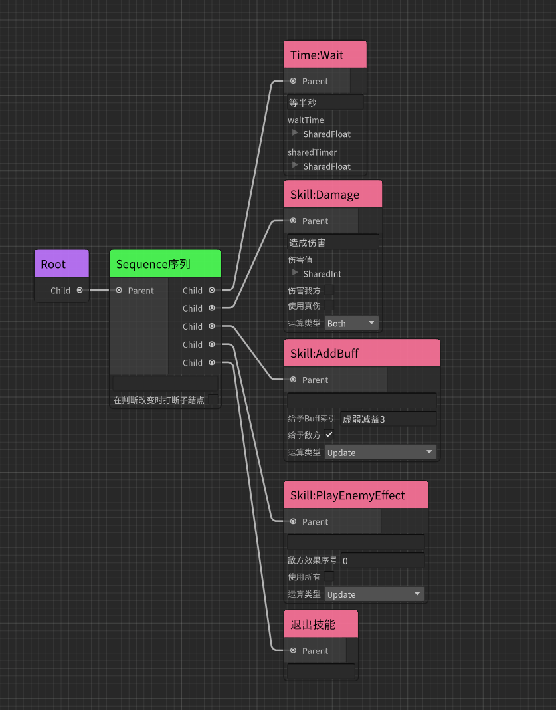
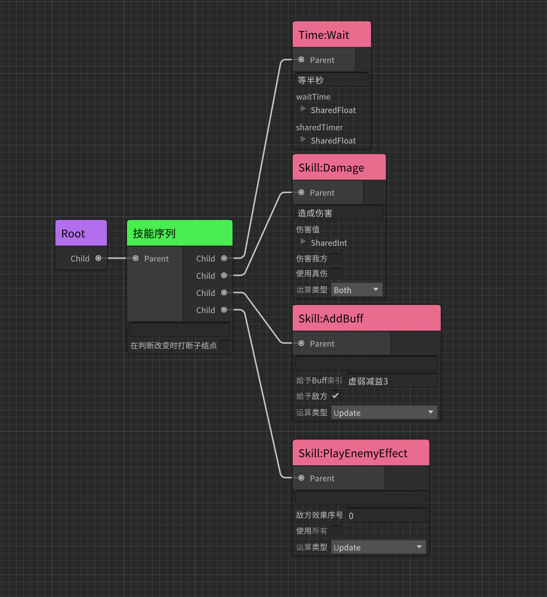

# 技能树 AkiST 简介 Intro


技能树AkiST是[爱姬kurisu](https://space.bilibili.com/20472331)根据技能系统做出的修改版本.  
技能树依赖于行为树[AkiBT](https://github.com/AkiKurisu/AkiBT)。
行为结点的创建可以完全参考AkiBT,仅使用时需要遵守一些规范.
#

## 支持的版本Supported version

* Unity 2019.4 or later.
#
## AkiST特点Features
* 支持使用可视化节点编辑器构造技能树.
* 使用独立的ScriptableObject,方便搭配和构建

## 使用方式How To Use
* 创建脚本继承SkillTreeSO,构建一个方法来从外部激活技能

```C#

public class BaseSkill : SkillTreeSO
{
    //默认为True,如果为Flase则无法编辑行为树,适用于没有复杂序列动作的技能
    public override bool UseTree=>true;
    public GameObject Owner{get;private set;}
    //这里可以传入你自定义的接口等等
    public void Play(GameObject owner)
    {
            //获取owner身上组件等
            Owner=owner;
            OnSkillEnter();
    }
}

```

* 创建技能系统SkillSystem,在Update中调用OnSkillUpdate方法，并且注册技能退出时的回调


```C#

public class SkillSystem : MonoBehaviour
{
    private BaseSkill currentSkill;
    //传入技能和使用者
    public void UseSkill(BaseSkill skill,GameObject user)
    {
        currentSkill=skill;
        currentSkill.Play(user);
        currentSkill.OnSkillExitEvent+=SkillExitHandler;
    }
    void Update()
    {
            if(currentSkill!=null)currentSkill.OnSkillUpdate();
    }
    void SkillExitHandler()
    {
        currentSkill.OnSkillExitEvent-=SkillExitHandler;
        currentSkill=null;
    }
}

```

## 注意事项General Note
* 和行为树不同,由于是完全在SO文件中运行,技能树的退出需要额外操作。
* 可以使用SkillExit结点放在所有逻辑的末尾来保证逻辑执行完后退出技能
  


* 可以使用SkillSequence结点替换普通序列,从而在所有子结点运行第一次运行完后自动退出技能。


  

