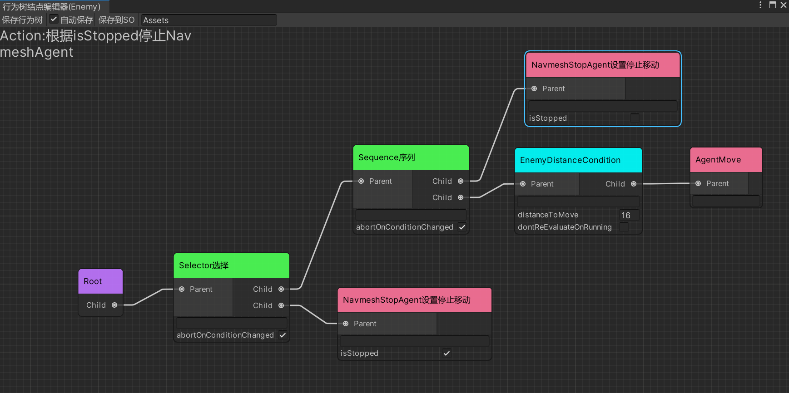
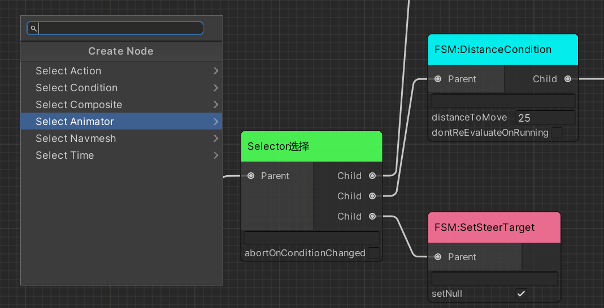
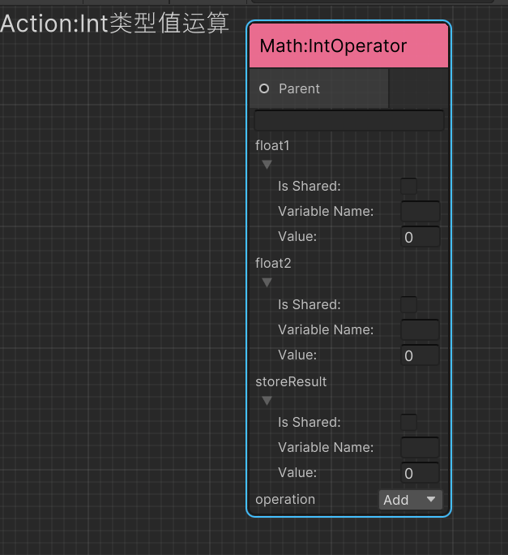
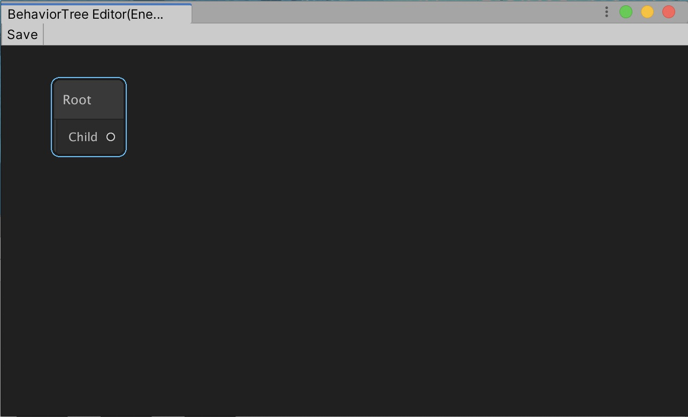
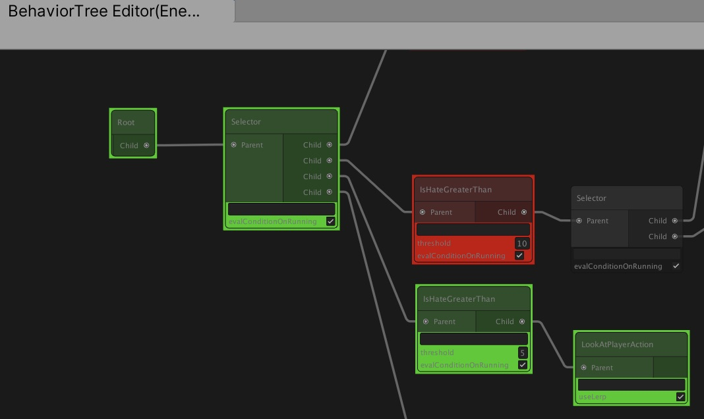

# 行为树 AkiBT 简介 Intro


[爱姬kurisu](https://space.bilibili.com/20472331)优化GraphView视图并拓展内置行为和编辑器功能的行为树.  
行为树衍生自[UniBT](https://github.com/yoshidan/UniBT),原作者[Yoshida](https://github.com/yoshidan/).
#

## 支持的版本Supported version

* Unity 2019.4 or later.
#
## AkiBT特点Features
* 支持使用可视化节点编辑器构造行为树Supports constructing behavior tree by [GraphView](https://docs.unity3d.com/ScriptReference/Experimental.GraphView.GraphView.html).
* 支持运行时可视化结点状态Supports visualizing active node in runtime.
* 非常便于拓展和自定义新的行为Easily add original behaviors(Action,Conditional,Composite).
#
## 视图优化Optimization
* 优化了结点创建菜单,根据类型分类
* 增加了左键选框
* 增加了背景和结点样式
* 设置Root结点为不可删除防止无法恢复
  
#
## 特性Attributes

1. 增加了Info特性用以描述结点行为,可以显示在结点编辑器中
```C#
  [AkiInfo("Action:根据isStopped停止NavmeshAgent")]
public class NavmeshStopAgent : Action
{
    private NavMeshAgent _navMeshAgent;
    [SerializeField]
    private bool isStopped;
    protected override Status OnUpdate()
    {
        if(_navMeshAgent!=null&&_navMeshAgent.isStopped!=isStopped)
        {
            _navMeshAgent.isStopped=isStopped;
        }
        return Status.Success;
    }
    public override void Awake()
    {
        _navMeshAgent=gameObject.GetComponent<NavMeshAgent>();
    }
    
    }
```


2. 增加了Label特性用以替换编辑器中的结点名称
   
```C#
[AkiLabel("NavmeshStopAgent设置停止移动")]
public class NavmeshStopAgent : Action
{
    private NavMeshAgent _navMeshAgent;
    [SerializeField]
    private bool isStopped;
    protected override Status OnUpdate()
    {
        if(_navMeshAgent!=null&&_navMeshAgent.isStopped!=isStopped)
        {
            _navMeshAgent.isStopped=isStopped;
        }
        return Status.Success;
    }
    public override void Awake()
    {
        _navMeshAgent=gameObject.GetComponent<NavMeshAgent>();
    }
    
    }
```


3. 增加了Group特性用以对结点进行分类

```c#
[AkiGroup("Animator")]
    public class AnimatorSetBool : AnimatorAction
    {
        [SerializeField]
        private string parameter;
        

        [SerializeField]
        private bool status;
        private int parameterHash;
        public override void Start() {
            parameterHash=Animator.StringToHash(parameter);
        }
        protected override Status OnUpdate()
        {
            animator.SetBool(parameterHash,status);
            return Status.Success;
        }
    }
```


#

## 保存功能Save Function

1. 增加自动保存设置和保存到ScriptableObject的功能


2. 你可以使用ScriptableObject化的外部行为树来替换组件内的行为树,需要注意的是使用外部行为树需要在打开结点编辑器前设置,“保存行为树”和“自动保存”不会将修改后的行为树同步到ScriptableObject,你可以再次点击“保存到SO”进行覆盖


#
## 新的结点类型New Node Type

1. 增加了装饰器结点类型Decorator Node.

```C#
 [AkiInfo("Decorator:直到子结点返回Success为止返回Running")]
[AkiLabel("WaitSuccess等待正确")]
public class WaitSuccess : Decorator
{
    protected override Status OnDecorate(Status childeStatus)
    {
        if(childeStatus==Status.Success)
            return Status.Success;
        else
            return Status.Running;
    }
}
```
#
## 共享变量SharedVairable

1. 增加了共享变量SharedVariable可以在黑板中添加,目前支持Float、Int、Vector3类型变量


* 注意：修改共享变量名称的方式为双击变量,为空时自动删除
  
* 例如Action/Math/IntOperator可以使用三个共享变量,默认为本地变量,如果你需要共享可以勾选Is Shared,勾选后需要填写变量名称,若运行时缺少该名称共享变量,则仍然作为本地变量.



#
# 使用方式(修改自原作者简介)


1. [Download](https://github.com/yoshidan/UniBT/releases) 直接下载，导入项目中


2. Add `AkiBT.BehaviorTree` component for any GameObject.  
   
3. `Open Graph Editor` button opens GraphView for Behavior Tree.  
   
4. Add behaviors and set parameters.  
5. Finally press save button on tool bar of the editor window. (If invalid node found the color of the node become red.)  
     
6. Run the unity application. you can see node status in the editor window.  
   
   
   * The red node means that last `Update` returned Status.Failure`.
   * The green node means that last `Update` returned `Status.Success`.
   * The yellow node means that last `Update` returned `Status.Running`.
7. you can save the GameObject with `UniBT.BehaviorTree` as prefab.

## 工作原理How It Works

* `AkiBT.BehaviorTree` updates child nodes in `Update` timing when the UpdateType is `UpdateType.Auto`.
* If you want to update at any time, change UpdateType to `UpdateType.Manual` and call `BehaviorTree.Tick()`;
* Only `UniBT.BehaviorTree` is the `MonoBehavior`. Each node is just a C# Serializable class.
* 你也可以直接在脚本中查看注释和Info特性中的描述
  
### Core Behavior Node

| Name | Description |
| ------- | --- |
| Composite Node | It has one or more child nodes and controls which child node to update. |
| Action Node | This is the leaf node. It execute action such as follow player, attack, escape or others you define. |
| Conditional Node | It has one child node and check the condition whether child is updatable. when having no child, Conditional Node is the leaf node like Action Node. |
| Decorator Node | It has one child node and 根据子结点返回值更改返回值.

| Name | Description | 
|------|-------|
| evaluateOnRunning | true : evaluate the condition if the previous status is `Status.Running`. |

### Built In Composite Node

I have prepared several built in Composite Node.

#### Sequence
* Updates the child nodes in order from the top. 
* Returns failure immediately if the child node returns failure. 
* Returns running immediately and calls the child at the next update timing if the child node returns running.
* Returns success if all child nodes return success.  

Sequence has following parameter.

| Name | Description | 
|------|-------|
| abortOnConditionChanged | true: Aborts the running node when a node with a higher priority than the running node becomes infeasible. Specifically, the execution result of `Conditional.CanUpdate`, which is a descendant of a node with a higher priority than the running node, is used. Abort功能也可以参照BehaviorDesigner的使用.|

#### Selector
* Updates the child nodes in order from the top. 
* Returns success immediately if the child node returns success. 
* Returns running immediately and calls the child at the next update timing if the child node returns running.
* Returns failure if all child nodes return failure.  

Selector has following parameter.

| Name | Description | 
|------|-------|
| abortOnConditionChanged | true: Aborts the running node when a node with a higher priority than the running node becomes executable. Specifically, the execution result of `Conditional.CanUpdate`, which is a descendant of a node with a higher priority than the running node, is used.Abort功能也可以参照BehaviorDesigner的使用.|

#### Parallel
* Updates all child nodes.  
* Returns running if any child node returns running.
* Returns failure if any child node returns failure.
* Otherwise, returns success.
* 由All更名为Parallel,功能与BehaviorDesigner的Parallel相同

#### Random
* The child nodes are elected and executed according to the probability based on the uniform distribution.  
* Select one for each update. However, if the running status is returned during the last update, the node will continue to run.

#### Rotator
* Updates the child nodes in order. Unlike Sequencer, one child node is executed by one update instead of executing all child nodes by one update.  
* For example, if there are three child nodes, the first Update will execute the top node, the next Update will execute the second node, and the next Update will execute the third node.  
* The next run will run the top node again.  
* If a child node returns a running state, it exits without executing subsequent child nodes, and the child node continues to run on the next update.

Rotator has following parameter.

| Name | Description | 
|------|-------|
| resetOnAbort | It is a flag whether to return the next execution target node from the top when the execution condition of the ancestor Conditional Node changes and the running node is interrupted.|


## 创建新的行为Create Behaviors

### Create Action
* Create C# Script and extends `AkiBT.Action`
* Override `OnUpdate` and return status(Success/Running/Failure).
* Override `Awake` called by `AkiBT.BehaviorTree.Awake` if needed.
* Override `Start` called by `AkiBT.BehaviorTree.Start` if needed.
* Override `Abort` to reset field or any state when the parent condition changed..
* Action has Node `gameObject` field with `AkiBT.BehaviorTree` attached.
* Private [SerializeField] field and public field can be set on Behavior Tree editor window.

```c#
public class Wait : Action
{
    [SerializeField] 
    private float waitTime;

    private float elapsedTime = 0.0f;

    protected override Status OnUpdate()
    {
        elapsedTime += Time.deltaTime;
        if (elapsedTime < waitTime)
        {
            return Status.Running;
        }

        elapsedTime = 0.0f;
        return Status.Success;
    }

    // abort when the parent conditional changed on previous status is running.
    public override void Abort()
    { 
        elapsedTime = 0.0f;
    }
}
```

### Create Conditional
* Create C# Script and extends `AkiBT.Conditional`
* Override `IsUpdatable` and return result(true/false). when `IsUpdatable` returns update child.
* Override `OnAwake` called by `AkiBT.BehaviorTree.Awake` if needed.
* Override `OnStart` called by `AkiBT.BehaviorTree.Start` if needed.
* Conditional Node has `gameObject` field with `AkiBT.BehaviorTree` attached.
* Private [SerializeField] field and public field can be set on Behavior Tree editor window.

```c#
public class IsHateGt: Conditional
{
    [SerializeField] 
    private int threshold;

    private Enemy enemy;

    protected override void OnAwake()
    {
        enemy = gameObject.GetComponent<Enemy>();
    }

    protected override bool IsUpdatable()
    {
        return enemy.Hate > threshold;
    }
}
```

* Conditional Node can be leaf node like Action Node.


* Conditional Node can be branch node.


### Create Composite
* Create C# Script and extends `AkiBT.Composite`
* Override `OnUpdate` and return status(Success/Running/Failure).
* Override `OnAwake` called by `AkiBT.BehaviorTree.Awake` if needed.
* Override `OnStart` called by `AkiBT.BehaviorTree.Start` if needed.
* To abort the running node when the condition changed override `Abort`.
* Composite Node has `gameObject` field with `AkiBT.BehaviorTree` attached.
* Private [SerializeField] field and public field can be set on Behavior Tree editor window.

```c#
[AkiInfo("Composite:随机选择,等待结点结束运行后重新选择")]
[AkiLabel("Random随机选择")]
public class Random : Composite
{
    private NodeBehavior runningNode;

    protected override Status OnUpdate()
    {
        // proceed to update same node when the previous status is running
        if (runningNode != null)
        {
            return HandleStatus(runningNode.Update(), runningNode);
        }

        // update random children
        var result = UnityEngine.Random.Range(0, Children.Count);
        var target = Children[result];
        return HandleStatus(target.Update(), target);
    }

    private Status HandleStatus(Status status, NodeBehavior updated)
    {
        //save running node for next update.
        runningNode = status == Status.Running ? updated : null;
        return status;
    }

    // abort when the parent conditional changed on previous status is running.
    public override void Abort()
    {
        if (runningNode != null)
        {
            runningNode.Abort();
            runningNode = null;
        }
    }
}
```

### Create Decorator
* Create C# Script and extends `AkiBT.Decorator`
* Override `OnDecortaor` 根据子结点返回值修改返回值.
* Override `OnAwake` called by `AkiBT.BehaviorTree.Awake` if needed.
* Override `OnStart` called by `AkiBT.BehaviorTree.Start` if needed.
* Composite Node has `gameObject` field with `AkiBT.BehaviorTree` attached.
* Private [SerializeField] field and public field can be set on Behavior Tree editor window.

```c#
[AkiInfo("Decorator:子结点返回Success则反转为Failure,为Failure则反转为Successs,返回Running则保持Running")]
[AkiLabel("Invertor反转")]
public class Invertor : Decorator
{
    protected override Status OnDecorate(Status childeStatus)
    {
        if(childeStatus==Status.Success)
            return Status.Failure;
        else if(childeStatus==Status.Failure)
            return Status.Success;
        else
            return childeStatus;
    }
}
```

