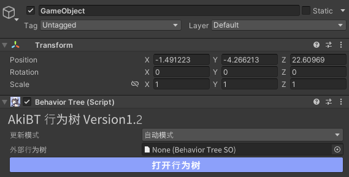
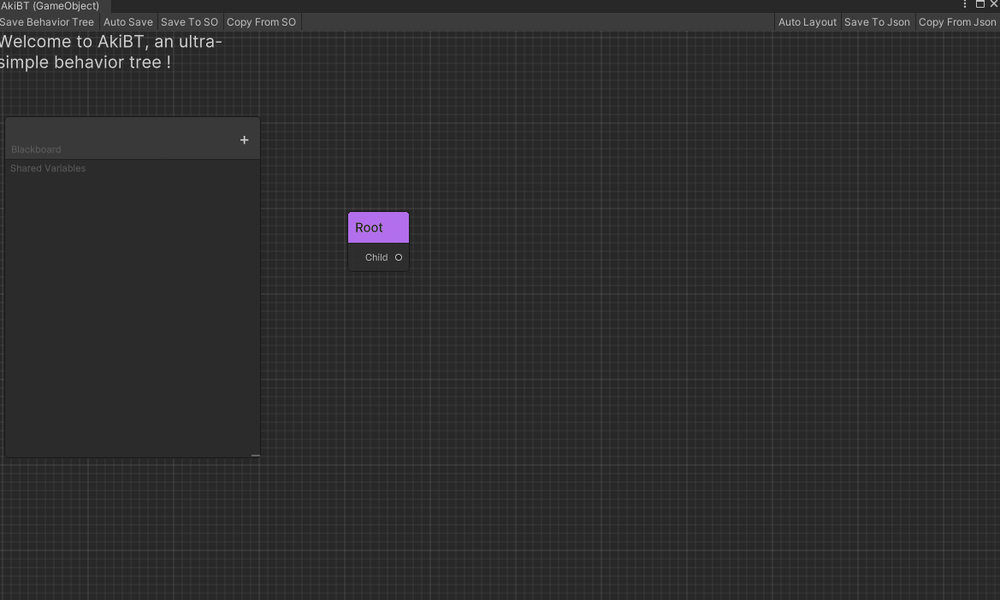
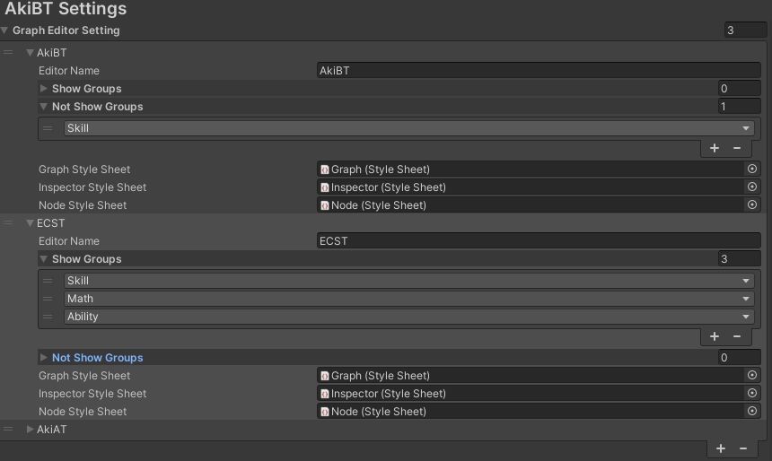
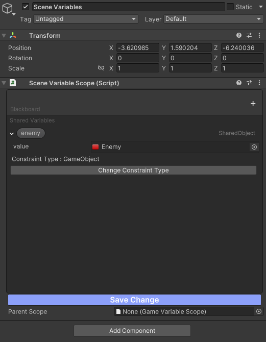
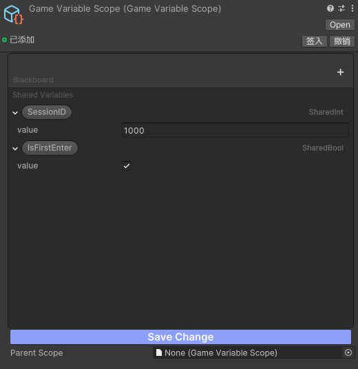
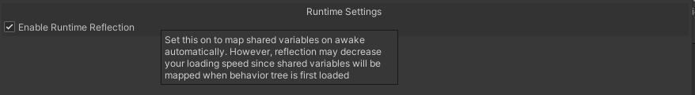
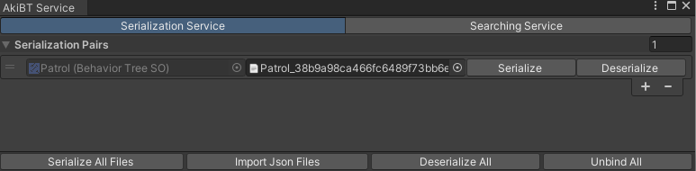

[](https://github.com/AkiKurisu/AkiBT/releases)
[](https://github.com/AkiKurisu/AkiBT/stargazers)
# AkiBT Version 1.4.2 Intro


***Read this document in Chinese: [中文文档](./README.md)***

AkiBT is a behavior tree node editor based on [UniBT](https://github.com/yoshidan/UniBT). The original author of UniBT is [Yoshida](https://github.com/yoshidan/). Based on the former, a large number of modern behavior tree editor functions are enriched.

## Setup
1. Download [Release Package](https://github.com/AkiKurisu/AkiBT/releases)
2. Using git URL to download package by Unity PackageManager ```https://github.com/AkiKurisu/AkiBT.git```


## Supported Version

* Unity 2021.3 or later.

## Dependencies

* Newtonsoft.Json

   Available for download in Unity PackageManager

## Features
* Supports constructing behavior tree by visual node editor.
* Support visualizing node status and debugging behavior tree during runtime
* Based on the GraphView framework, it is very convenient to expand the editor and customize new behaviors
* What you see is what you get, all fields are on the graph, this is also the biggest difference between the design of AkiBT and other editors.

## Quick Start

   

1. Add `AkiBT.BehaviorTree` component for any GameObject.  
   
2. `Open Graph Editor` button opens GraphView for Behavior Tree.  
   
3. Add behaviors and set parameters.  
   
4. Finally press save button on tool bar of the editor window. (If invalid node found the color of the node become red.)  
     
5. Run the unity application. you can see node status in the editor window.  
   
   
   * The red node means that last `Update` returned `Status.Failure`.
   * The green node means that last `Update` returned `Status.Success`.
   * The yellow node means that last `Update` returned `Status.Running`.
6. You can save the GameObject with `AkiBT.BehaviorTree` as prefab or save to ScriptableObject or save to json file.

7. Tutorial Video On BiliBili (The version in video is older and needs to be updated)
   
   [开源行为树AkiBT使用教程](https://www.bilibili.com/video/BV1Jd4y187XL/)

## How It Works

* `AkiBT.BehaviorTree` updates child nodes in `Update` timing when the UpdateType is `UpdateType.Auto`.
* If you want to update at any time, change UpdateType to `UpdateType.Manual` and call `BehaviorTree.Tick()`;
* Only `AkiBT.BehaviorTree` is the `MonoBehavior`. Each node is just a C# Serializable class.
  
  
## Editor Advanced

This part will explain the advanced skills and knowledge related to using AkiBT Editor:

### Save, copy and paste

   You can click on the node Ctrl+C&&Ctrl+V or right-click and select Duplicate to copy the node. You can also batch select to copy and paste.

   You can select Copy From SO from the upper toolbar, or drag and drop BehaviorTreeSO, BehaviorTree components, or GameObject and Json files that mount BehaviorTree into the editor to copy and paste.

   

### Edit shared variables in the editor

   SharedVariable can be added in the blackboard. Variables currently support Float, Int, Vector3, Bool, String, UnityEngine.Object and their inherited subtypes.

   

   * For SharedVariable in the field, check ``Is Shared`` and a drop-down menu will appear for binding shared variables in the behavior tree blackboard.

   

   * SharedObject supports type restrictions, see [SharedVariable](./API.md#SharedVariable) for details

   * Double-click the shared variable to modify the name, delete it if it is empty, and update the node field that references the variable after modification.
      

   * Inspector can modify and delete shared variables

   

### Filter nodes

   You can set the search mask for the AkiBT editor or other editors inherited from AkiBT in ProjectSetting. You can set the Group type required in the workflow (see above for Group attributes). Nodes without Group attributes will not be filtered.

   

### Combination stack node style (experimental)

   Connecting Composite nodes to child nodes may be troublesome, especially when reordering. You can use Composite Stack to replace the traditional node style. There is no node using this style in the built-in nodes. If you need to use it, you need to write a ``NodeResolver`` to declare the nodes used, the example is as follows:
```C#
using System;
namespace Kurisu.AkiBT.Editor
{
   [Ordered]
   public class SequenceResolver : INodeResolver
   {
      public IBehaviorTreeNode CreateNodeInstance(Type type)
      {
            return new SequenceStack();
      }
      public static bool IsAcceptable(Type behaviorType) => behaviorType == typeof(Sequence);
   }
   public class SequenceStack : CompositeStack { }
}

```
   
   Of course, this feature currently has some limitations, such as the inability to nest Composite Stack, which will be resolved later.

## Runtime Advanced

This part will explain the advanced skills and knowledge related to using AkiBT's Runtime:

### Use global shared variables

For shared variables across Prefabs in the same scene, you can use ``SceneVariableScope`` (MonoBehaviour) to create ``Global Variables`` that are effective within the scene.



For shared variables across scenes, you can use ``GameVariableScope`` (ScriptableObject) to create ``Global Variables`` that are effective within the application. For packaged games, you need to manually load the ScriptableObject from the resource loading scheme, such as using ``Resources. Load()`` to load



Different scopes can depend on each other. For example, ``SceneVariableScope`` can set ``GameVariableScope`` to ParentScope to obtain global shared variables within the application.

#### How to bind global shared variables?

   View the field in the Inspector and click ``Is Global`` to mark it. The behavior tree will bind the global shared variable before the shared variable is initialized.

   

   * The button text is green after marking
### Generic object shared variable SharedTObject

   In a custom node, you can use `SharedTObject<T>` to create a generic object (UnityEngine.Object) shared variable. Its binding logic is the same as `SharedObject`, as shown in `IBindableVariable<T>`, The benefit is that you can have safer type checking

### Initialize shared variables

   AkiBT supports two ways to initialize shared variables. This step is to bind the shared variables in the node to those in the behavior tree. Please make sure that the variable has been initialized before using it.
   The first is manual initialization, the example is as follows

   ```C#
   public abstract class AnimatorAction : Action
   {
      [SerializeField]
      private SharedTObject<Animator> animator;
      public override void Awake()
      {
         InitVariable(animator);
      }
   }
   ```

   The second is to use C# reflection. You need to check `Enable Runtime Reflection` in ProjectSetting/AkiBTSetting. The behavior tree will use reflection to obtain all shared variables for initialization during initial loading.

   

### Debugging behavior tree

   Shared variables can be modified in the Inspector or editor during runtime to debug the behavior tree. Global variables need to be modified in their corresponding scopes.

   

### Json serialization

   Using Json serialization in the Editor will save the GUID that refers to the ``UnityEngine.Object`` (hereinafter referred to as UObject) object. However, the UObject object cannot be obtained when Json is deserialized at Runtime. You need to load the required objects in other ways at Runtime. UObject objects, for example, change all references to UObject in the behavior tree to ``SharedTObject<T>`` and ``SharedObject``, and obtain them from your resource loading scheme through their names at runtime, such as `Addressable` resources Address or file path of `AssetBundle`.

## Extend Node

***See [API Document](./API.md)***

## Extend Editor

***See [API Document](./API.md)***

## Extra Module

### Runtime Update Support
   

   You can use [AkiBTDSL](https://github.com/AkiKurisu/AkiBTDSL) to make it easier to edit the behavior tree at runtime or outside the project. It can be exported to a DSL (text domain-specific language) format that is easy to read and modify, such as It is convenient to establish unified editing of Excel tables and separate the behavior tree editing environment and project environment.

### User Service


   The plugin currently has a new User Service (Tools/AkiBT/AkiBT User Service) built in, which provides two functions Serialize Service and Search Service

   ### 1. Serialize Service
   Since AkiBT uses ScriptableObject for data storage, data loss will occur when modifying the field name of the node (this problem can be avoided by adding `FormerlySerializedAsAttribute` to the modified field). However, after modifying the name and namespace of the node, the entire node cannot be deserialized, thus losing all data of the node and subsequent nodes. After serializing to Json, you can use a text editor to modify the nodes in batches, and then re-deserialize to ScriptableObject.

   

   It should be noted that not all fields of ScriptableObject are serialized. Serialize Service only serializes the nodes and shared variables of the behavior tree, and the deserialization is the same.
   
  ### 2. Search Service
  Select a node type to quickly find all behavior trees using the node, and combine with Serialize Service to find the corresponding Json file at the same time.