[](https://github.com/AkiKurisu/AkiBT/releases)
[](https://github.com/AkiKurisu/AkiBT/stargazers)
<div align="center">

# 行为树 AkiBT Version 1.5.0

***Read this document in English: [English Document](./README.md)***

AkiBT是以[UniBT](https://github.com/yoshidan/UniBT)作为基础的行为树结点编辑器, 并在前者基础上丰富了众多现代行为树编辑器功能.

   

</div>

## 安装
1. 下载最新的[Release Package](https://github.com/AkiKurisu/AkiBT/releases)
2. 使用git URL在Unity PackageManager中进行下载 ```https://github.com/AkiKurisu/AkiBT.git```


## 支持的版本

* Unity 2021.3 or later.

## 依赖

* Newtonsoft.Json 

## 特点
* 支持使用可视化节点编辑器构造行为树
* 支持运行时可视化结点状态，调试行为树
* 基于GraphView框架，非常便于拓展编辑器和自定义新的行为
* 所见即所得的编辑界面，所有字段都在图上，这也是AkiBT和其他编辑器设计方式最大的不同

## 快速开始

1. 为需要添加行为树的GameObject挂载 `AkiBT.BehaviorTreeComponent` 组件.  
   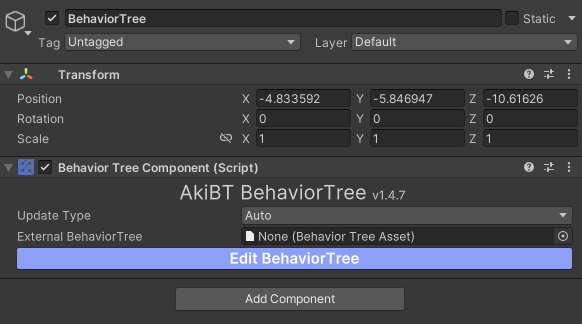
2. 点击`Open Graph Editor` 打开结点编辑器.  
   
3. 添加结点并修改字段.  
   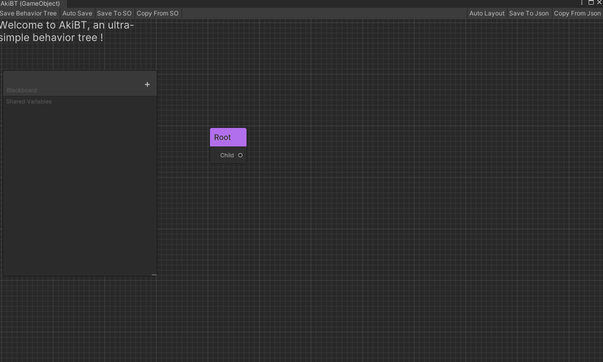
4. 点击保存，如果保存失败会在失败处显示红色
   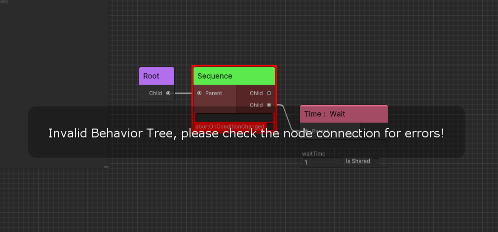  
5. 进入游戏可以在编辑器内看到运行的状态以不同颜色显示
   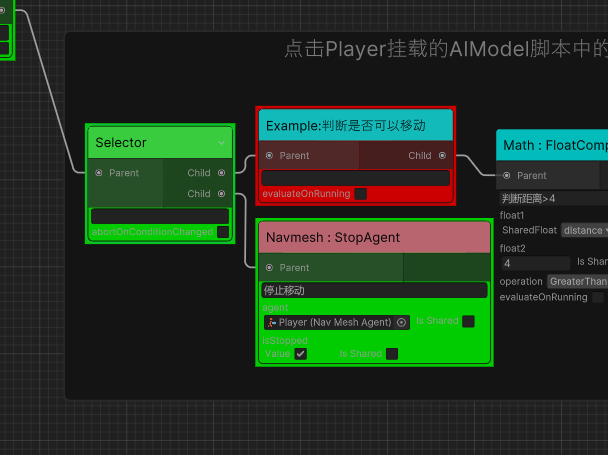
   
   * 红色代表上次 `Update` 返回了 `Status.Failure`
   * 绿色代表上次 `Update` 返回了 `Status.Success`
   * 黄色代表上次 `Update` 返回了 `Status.Running`
6. 你可以将挂载 `AkiBT.BehaviorTreeComponent` 的GameObject保存为预制体或保存为ScriptableObject或序列化为Json

7. BiliBili 的教学视频（视频中使用的版本较老，待更新）
   
   [开源行为树AkiBT使用教程](https://www.bilibili.com/video/BV1Jd4y187XL/)

## 工作原理

* 当UpdateType为`UpdateType.Auto`时，`AkiBT.BehaviorTreeComponent`会在`Update`定时更新子节点。
* 如果想随时更新，请将UpdateType更改为`UpdateType.Manual`并调用`BehaviorTree.Tick()`；
* 只有`AkiBT.BehaviorTreeComponent`是`MonoBehavior`。 每个节点只是一个 C# 可序列化类。
  


## Editor进阶

这一部分将讲解使用AkiBT的Editor（编辑器）相关进阶技巧和知识：

### 保存、复制和粘贴

   你可以点击结点Ctrl+C&&Ctrl+V或右键选择Duplicate复制结点，你也可以批量选择进行复制粘贴

   你可以从上侧工具栏选择```Copy from Asset```，也可以将`BehaviorTreeAsset`、`BehaviorTreeComponent`组件或挂载`BehaviorTreeComponent`的GameObject、Json文件拖拽进编辑器中进行复制粘贴。
   

   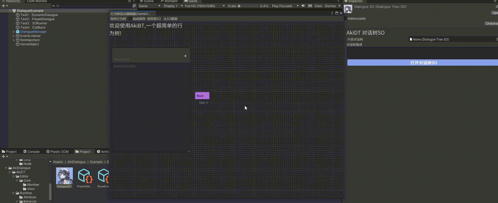

### 编辑器内编辑共享变量

   SharedVariable可以在黑板中添加。
   
   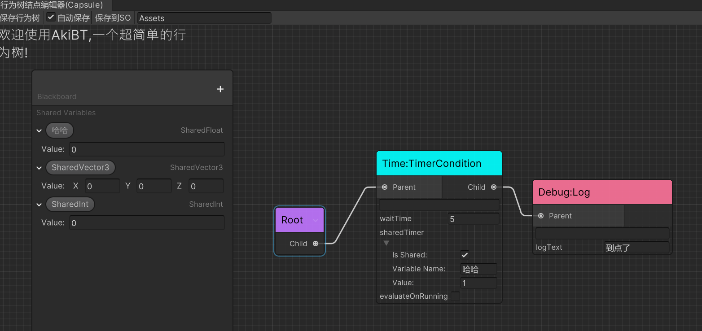

   * 字段中的SharedVariable勾选``Is Shared``出现下来菜单用于绑定行为树黑板中的共享变量

   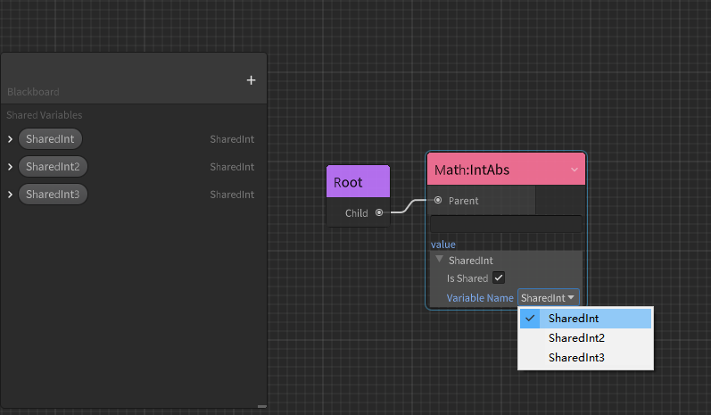

   * SharedObject支持进行类型限制,详见[SharedVariable](./runtime-extensions.md#SharedVariable)

   * 双击共享变量以修改名称,为空时删除，修改后同时更新引用该变量的结点字段
        

   * Inspector可以对共享变量进行修改和删除

   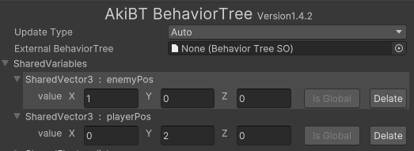

### 过滤结点

   你可以在ProjectSetting中设置AkiBT编辑器或者其余继承自AkiBT的编辑器的搜索遮罩。你可以设置工作流中需要的Group类型（Group特性相关见上文）,没有添加Group特性的结点不会被过滤。

   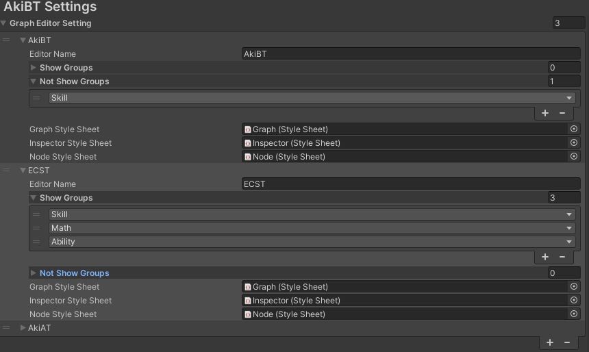

### 子树

   当打开节点搜索窗口，你可以看到项目中所有的`BehaviorTreeAsset`, 你可以导入编辑器视图中作为子树。

   子树中所有勾选`IsExposed`的共享变量会绑定到父树实例上。

### 类型丢失

   如果修改了节点的类、命名空间和程序集，序列化会失败。目前编辑器会将它们转为`InvalidNode`并保留序列化数据为字符串。

   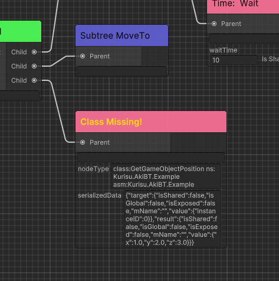

## Runtime进阶

这一部分将讲解使用AkiBT的Runtime（运行时）相关进阶技巧和知识：

### 使用全局共享变量

对于同场景跨Prefab的共享变量可以使用``SceneVariableScope``（MonoBehaviour）创建场景内生效的``Global Variables``

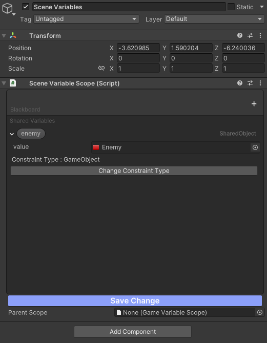

对于跨场景的共享变量可以使用``GameVariableScope``（ScriptableObject）创建应用内生效的``Global Variables``，对于打包后的游戏你需要手动从资源加载方案中加载该ScriptableObject例如使用``Resources.Load()``进行加载

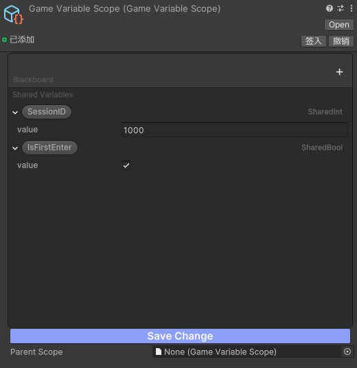

不同的作用域之间可以互相依赖例如``SceneVariableScope``可以将``GameVariableScope``设置为ParentScope从而获取应用内的全局共享变量

#### 如何绑定全局共享变量？

   在Inspector中查看字段，点击``Is Global``将其标记，行为树将在共享变量初始化前先绑定全局共享变量

   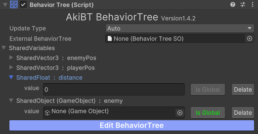

   * 标记后按钮文本为绿色
### 泛型对象共享变量 SharedTObject

   在自定义结点中，你可以使用`SharedTObject<T>`来创建一个泛型对象（UnityEngine.Object）共享变量，其绑定逻辑与`SharedObject`相同，可见``IBindableVariable<T>``，好处是你可以拥有更安全的类型检查

### 调试行为树

   运行时可以在Inspector或编辑器中修改共享变量从而调试行为树，全局变量需要在其相应作用域进行修改

   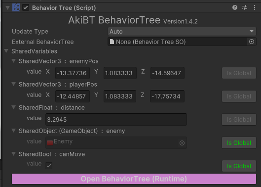

### Json序列化

   在Editor中使用Json序列化会保存引用``UnityEngine.Object``（以下简称UObject）对象的GUID，而Runtime时Json反序列时无法获取UObject对象，你需要在Runtime通过别的方式加载所需要的UObject对象，例如将行为树中对UObject的引用全部改为``SharedTObject<T>``和``SharedObject``，在Runtime通过其名称从你的资源加载方案中获取，例如`Addressable`的资源地址或`AssetBundle`的文件路径。

## 如何拓展结点

***查看 [运行时拓展](./Documentation~/runtime-extensions.md)***

## 如何拓展编辑器

***查看 [编辑器拓展](./Documentation~/editor-extensions.md)***

## 拓展功能 Extra Module

## DSL
   
你可以使用[AkiBTDSL](./Documentation~/dsl.md)实现运行时或在项目外更方便编辑行为树, 可导出成便于阅读和修改的DSL（特定领域语言）格式，例如方便建立Excel表格统一编辑。


## 开发便捷服务

插件目前内置了新的User Service(Tools/AkiBT/AkiBT User Service), 提供了两个功能Serialize Service和Search Service

### Serialize Service
   
由于AkiBT使用ScriptableObject进行数据存储,在修改结点的字段名称时会导致数据的丢失（该问题可以通过在修改字段上添加`FormerlySerializedAsAttribute`进行避免）。而对于结点的名称、命名空间进行修改后也会导致整个结点无法被反序列化，从而丢失该结点以及之后结点的所有数据。批量序列化为Json后，你可以使用文本编辑器批量对结点Ctrl+F进行修改，再使用Serialize Service重新批量反序列化为ScriptableObject。

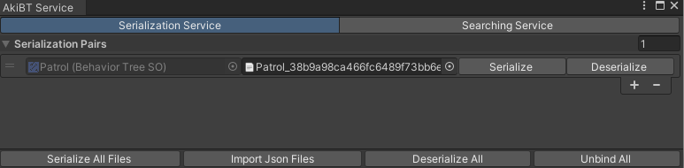

需要注意的是, 并非所有的字段都被序列化，Serialize Service只对行为树的结点和共享变量进行序列化，反序列化同理，继承类型的字段需要你额外进行处理。
   
### Search Service

选择结点类型快速找到使用该结点的所有行为树, 结合Serialize Service可以同时找到对应的Json文件。
