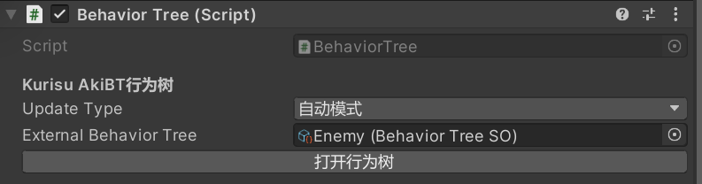
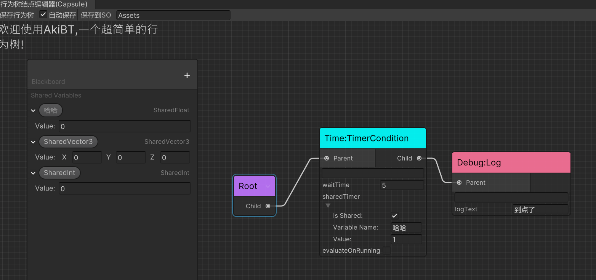
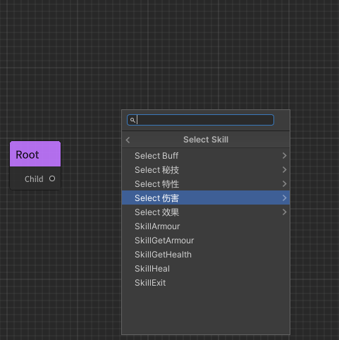
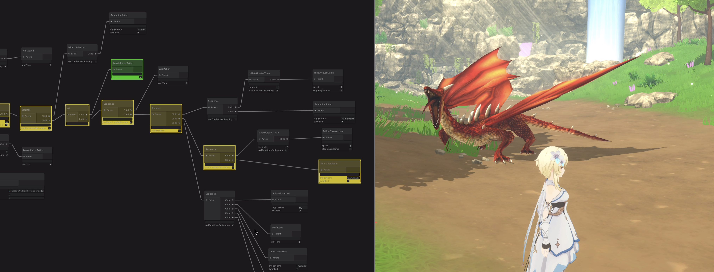
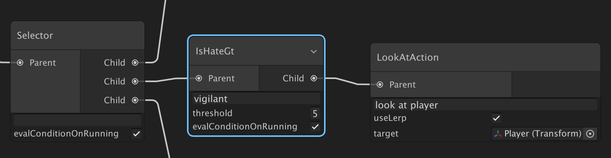

[](https://github.com/AkiKurisu/AkiBT/releases)
# 行为树 AkiBT 简介 Intro


[爱姬kurisu](https://space.bilibili.com/20472331)优化GraphView视图并拓展内置行为和编辑器功能的行为树.  
行为树衍生自[UniBT](https://github.com/yoshidan/UniBT),原作者[Yoshida](https://github.com/yoshidan/).
AkiBT is a visual node editor derived from UniBT created by Yoshida for making behavior tree or other tree-based function.AkiKurisu Extends it with more features so that you can enjoy it.
#

## 支持的版本Supported version

* AkiBT1.1 Unity 2019.4 or later.
* AkiBT1.2 Unity 2021.3 or later.(使用了新版本UIToolkit的DropdownField和TreeView)
#
## AkiBT特点Features
* 支持使用可视化节点编辑器构造行为树Supports constructing behavior tree by [GraphView](https://docs.unity3d.com/ScriptReference/Experimental.GraphView.GraphView.html).
* 支持运行时可视化结点状态Supports visualizing active node in runtime.
* 非常便于拓展和自定义新的行为Easily add original behaviors(Action,Conditional,Composite,Decorator).
#
## 视图优化Optimization
* 优化了结点创建菜单,根据类型分类Optimize NodeSearchWindow and improve it with an advanced subCategory attribute.
* 增加了左键选框Add SelectionDragger using Left Mouse.
* 增加了背景和结点样式Add style for both background and nodes.
* 设置Root结点为不可删除防止无法恢复Set Root's Capablity to Undeletable.
* 1.2.2版本加入了List的显示功能,后续会支持Array数组的显示
* 1.2.3版本加入了复制粘贴功能(Ctrl+C&&Ctrl+V或者右键单个结点的Duplicate选项)
#

## 保存功能Save Function

1. 增加自动保存设置和保存到ScriptableObject的功能Add Auto-Save function and Save-To-ScriptableObject function.


#

2. 你可以使用ScriptableObject化的外部行为树来替换组件内的行为树,需要注意的是使用外部行为树需要在打开结点编辑器前设置,同时该功能并非运行外部的行为树,而是在编辑器内以SO为模板绘制行为树,因此“保存行为树”和“自动保存”不会将修改后的行为树覆盖到SO。You can use External Tree to replaced the BehaviorTree Component in Inspector with it.However,you cant use it for runtime-using such as replacing tree data in playing mode.It is designed for editing nodes based on another behavior tree.It's an Editor-Only feature.Although the visual node editor will draw the tree by exteral tree,you cant edit the tree in the SO by click 'Saving BehaviorTree' which will only effect the tree in the Component.



#
3. 1.1版本增加了ScriptableObject的修改功能,你可以在SO中点击按钮直接编辑SO文件！You can edit SO directly in version1.1.
   


#
## 新的结点类型New Node Type

1. 增加了装饰器结点类型Decorator Node.

```C#
 [AkiInfo("Decorator:直到子结点返回Success为止返回Running")]
[AkiLabel("WaitSuccess等待正确")]
public class WaitSuccess : Decorator
{
    protected override Status OnDecorate(Status childeStatus)
    {
        if(childeStatus==Status.Success)
            return Status.Success;
        else
            return Status.Running;
    }
}
```
#
## 共享变量SharedVairable

1. 增加了共享变量SharedVariable可以在黑板中添加,目前支持Float、Int、Vector3、Bool类型变量Add SharedVariable which lets you have access to add it in a blackboard and share value between different node.Now it supports Float,Int,Vector3,Bool, maybe I will add String , GameObject in the future.



* 注意：修改共享变量名称的方式为双击变量,为空时自动删除You can edit variable's name by double-click it and the variable will auto delate when it's name becomes empty.

* 1.2.3版本加入了右键删除和更新所有引用该共享变量的字段,方便修改变量名称时不用一个个手动重选In version1.2.3,I add a menu when you left-click the blackboardRaw,you can easily delate it and refresh all the referenced fields when updating the name of variable.
  
* 例如Action/Math/IntOperator可以使用三个共享变量,默认为本地变量,如果你需要共享可以勾选Is Shared,勾选后需要填写变量名称,若运行时缺少该名称共享变量,则仍然作为本地变量.SharedVariable supports static-using,if you dont want to relate it with variables in blackboard,you just need make 'Is Shared' toogle to False.If you have a variable with invalide name,it will stay unShared in playing mode.


2. 需要注意的是,共享变量在1.1版本会和SO文件一同被保存和替换SharedVariable will be replaced when you save the tree.


3. 1.2版本增加了Inspector中共享变量的修改和删除功能,方便在Inspector中直接修改暴露引用的数值In version1.2,you can edit the exposed sharedvariable's value in the inspector.


4. 1.2版本将编辑器内的共享变量修改为Dropdown下拉菜单,无需重复填写StringField for SharedVariable is now replaced with a DropdownField which is easier to edit.


#
## 特性Attributes

1. 增加了Info特性用以描述结点行为,可以显示在结点编辑器中.You can use AkiInfo attribute to describe the behavior detail of the node for information.
```C#
  [AkiInfo("Action:根据isStopped停止NavmeshAgent")]
public class NavmeshStopAgent : Action
{
    private NavMeshAgent _navMeshAgent;
}
```


#

2. 增加了Label特性用以替换编辑器中的结点名称,新版本中你同样可以使用AkiLabel替换编辑器中的字段名称.AkiLabel attrubte is added for replacing label of node's title or field especailly for Chinese.
   
```C#
[AkiLabel("Navmesh:StopAgent")]
public class NavmeshStopAgent : Action
{
    private NavMeshAgent _navMeshAgent;
    [SerializeField,AkiLabel("是否停止")]
    private SharedBool isStopped;
    }
```


#

3. 增加了Group特性用以对结点进行分类AkiGroup is an advanced attribute using in Node Searching,you can add this attribute to make it easier and more clear to find certain node.

```c#
    [AkiGroup("Animator")]
    public class AnimatorSetBool : AnimatorAction
    {
        
    }
```


在1.2版本你可以使用'/'符号进行子分类You can also subcategory the SearchWindow by using '/'.



#

## 设置界面

1.2版本中增加了搜索结点的筛选设置,你可以在ProjectSetting中设置AkiBT编辑器或者其余继承自AkiBT的编辑器的搜索遮罩。你可以设置工作流中需要的Group类型（Group特性相关见上文）,没有添加Group特性的结点不会被过滤。Sometimes you maynot care about some nodes,you can add the AkiGroup attribute that makes them in a certain named group.Then you can edit the setting in ProjectSetting where you can add mask for the group you want to see in the SearchWindow.To be mentioned,the mask is relating to the editor you used.As default,the AkiBT editor is named with 'AkiBT',so you should edit the 'EditorName' with it. 


#
# 使用方式(修改自原作者简介)


1. [Download](https://github.com/AkiKurisu/AkiBT/releases) 直接下载,导入项目中,需要注意的是Gizmos文件夹需要放在Assets目录下。


2. Add `AkiBT.BehaviorTree` component for any GameObject.  
   
3. `Open Graph Editor` button opens GraphView for Behavior Tree.  
   
4. Add behaviors and set parameters.  
5. Finally press save button on tool bar of the editor window. (If invalid node found the color of the node become red.)  
     
6. Run the unity application. you can see node status in the editor window.  
   
   
   * The red node means that last `Update` returned Status.Failure`.
   * The green node means that last `Update` returned `Status.Success`.
   * The yellow node means that last `Update` returned `Status.Running`.
7. you can save the GameObject with `AkiBT.BehaviorTree` as prefab.

## 工作原理How It Works

* `AkiBT.BehaviorTree` updates child nodes in `Update` timing when the UpdateType is `UpdateType.Auto`.
* If you want to update at any time, change UpdateType to `UpdateType.Manual` and call `BehaviorTree.Tick()`;
* Only `AkiBT.BehaviorTree` is the `MonoBehavior`. Each node is just a C# Serializable class.
* 你也可以直接在脚本中查看注释和Info特性中的描述
  
### Core Behavior Node

| Name | Description |
| ------- | --- |
| Composite Node | It has one or more child nodes and controls which child node to update. |
| Action Node | This is the leaf node. It execute action such as follow player, attack, escape or others you define. |
| Conditional Node | It has one child node and check the condition whether child is updatable. when having no child, Conditional Node is the leaf node like Action Node. |
| Decorator Node | It has one child node and 根据子结点返回值更改返回值.

| Name | Description | 
|------|-------|
| evaluateOnRunning | true : evaluate the condition if the previous status is `Status.Running`. |

### Built In Composite Node

I have prepared several built in Composite Node.

#### Sequence
* Updates the child nodes in order from the top. 
* Returns failure immediately if the child node returns failure. 
* Returns running immediately and calls the child at the next update timing if the child node returns running.
* Returns success if all child nodes return success.  

Sequence has following parameter.

| Name | Description | 
|------|-------|
| abortOnConditionChanged | true: Aborts the running node when a node with a higher priority than the running node becomes infeasible. Specifically, the execution result of `Conditional.CanUpdate`, which is a descendant of a node with a higher priority than the running node, is used. Abort功能也可以参照BehaviorDesigner的使用.|

#### Selector
* Updates the child nodes in order from the top. 
* Returns success immediately if the child node returns success. 
* Returns running immediately and calls the child at the next update timing if the child node returns running.
* Returns failure if all child nodes return failure.  

Selector has following parameter.

| Name | Description | 
|------|-------|
| abortOnConditionChanged | true: Aborts the running node when a node with a higher priority than the running node becomes executable. Specifically, the execution result of `Conditional.CanUpdate`, which is a descendant of a node with a higher priority than the running node, is used.Abort功能也可以参照BehaviorDesigner的使用.|

#### Parallel
* Updates all child nodes.
* Returns running if any child node returns running.
* Returns failure if any child node returns failure.
* Otherwise, returns success.
* 注意:如果存在返回值为Running的子结点,Parallel平行会一直保持Running,并且持续Update所有子结点。
* AkiBT版本由All更名为Parallel。

#### Random
* The child nodes are elected and executed according to the probability based on the uniform distribution.  
* Select one for each update. However, if the running status is returned during the last update, the node will continue to run.

#### Rotator
* Updates the child nodes in order. Unlike Sequencer, one child node is executed by one update instead of executing all child nodes by one update.  
* For example, if there are three child nodes, the first Update will execute the top node, the next Update will execute the second node, and the next Update will execute the third node.  
* The next run will run the top node again.  
* If a child node returns a running state, it exits without executing subsequent child nodes, and the child node continues to run on the next update.

Rotator has following parameter.

| Name | Description | 
|------|-------|
| resetOnAbort | It is a flag whether to return the next execution target node from the top when the execution condition of the ancestor Conditional Node changes and the running node is interrupted.|


## 创建新的行为Create Behaviors

### Create Action
* Create C# Script and extends `AkiBT.Action`
* Override `OnUpdate` and return status(Success/Running/Failure).
* Override `Awake` called by `AkiBT.BehaviorTree.Awake` if needed.
* Override `Start` called by `AkiBT.BehaviorTree.Start` if needed.
* Override `Abort` to reset field or any state when the parent condition changed..
* Action has Node `gameObject` field with `AkiBT.BehaviorTree` attached.
* Private [SerializeField] field and public field can be set on Behavior Tree editor window.

```c#
public class Wait : Action
{
    [SerializeField] 
    private float waitTime;

    private float elapsedTime = 0.0f;

    protected override Status OnUpdate()
    {
        elapsedTime += Time.deltaTime;
        if (elapsedTime < waitTime)
        {
            return Status.Running;
        }

        elapsedTime = 0.0f;
        return Status.Success;
    }

    // abort when the parent conditional changed on previous status is running.
    public override void Abort()
    { 
        elapsedTime = 0.0f;
    }
}
```

### Create Conditional
* Create C# Script and extends `AkiBT.Conditional`
* Override `IsUpdatable` and return result(true/false). when `IsUpdatable` returns update child.
* Override `OnAwake` called by `AkiBT.BehaviorTree.Awake` if needed.
* Override `OnStart` called by `AkiBT.BehaviorTree.Start` if needed.
* Conditional Node has `gameObject` field with `AkiBT.BehaviorTree` attached.
* Private [SerializeField] field and public field can be set on Behavior Tree editor window.

```c#
public class IsHateGt: Conditional
{
    [SerializeField] 
    private int threshold;

    private Enemy enemy;

    protected override void OnAwake()
    {
        enemy = gameObject.GetComponent<Enemy>();
    }

    protected override bool IsUpdatable()
    {
        return enemy.Hate > threshold;
    }
}
```

* Conditional Node can be leaf node like Action Node.


* Conditional Node can be branch node.
* 注:原作者将Conditional结点设计为可以单独作为叶结点,即将子结点置空,只根据判断返回Success和Failure。但我并不推荐将行为逻辑写在Conditional中,这会带来判断逻辑和行为逻辑的混同。



### Create Composite
* Create C# Script and extends `AkiBT.Composite`
* Override `OnUpdate` and return status(Success/Running/Failure).
* Override `OnAwake` called by `AkiBT.BehaviorTree.Awake` if needed.
* Override `OnStart` called by `AkiBT.BehaviorTree.Start` if needed.
* To abort the running node when the condition changed override `Abort`.
* Composite Node has `gameObject` field with `AkiBT.BehaviorTree` attached.
* Private [SerializeField] field and public field can be set on Behavior Tree editor window.

```c#
[AkiInfo("Composite:随机选择,等待结点结束运行后重新选择")]
[AkiLabel("Random随机选择")]
public class Random : Composite
{
    private NodeBehavior runningNode;

    protected override Status OnUpdate()
    {
        // proceed to update same node when the previous status is running
        if (runningNode != null)
        {
            return HandleStatus(runningNode.Update(), runningNode);
        }

        // update random children
        var result = UnityEngine.Random.Range(0, Children.Count);
        var target = Children[result];
        return HandleStatus(target.Update(), target);
    }

    private Status HandleStatus(Status status, NodeBehavior updated)
    {
        //save running node for next update.
        runningNode = status == Status.Running ? updated : null;
        return status;
    }

    // abort when the parent conditional changed on previous status is running.
    public override void Abort()
    {
        if (runningNode != null)
        {
            runningNode.Abort();
            runningNode = null;
        }
    }
}
```

### Create Decorator
* 装饰器结点类型用来对返回值进行修饰,缩减使用的Conditional或Composite结点数量
* Create C# Script and extends `AkiBT.Decorator`
* Override `OnDecorate(Status childStatus)` 根据子结点返回值修改返回值.
* Decorator继承了子结点的CanUpdate,即如果子结点为Conditional,该结点会继承其判断值,如果要修饰CanUpdate可以Override`OnDecorate(bool childCanUpdate)`
* Override `OnAwake` called by `AkiBT.BehaviorTree.Awake` if needed.
* Override `OnStart` called by `AkiBT.BehaviorTree.Start` if needed.
* Composite Node has `gameObject` field with `AkiBT.BehaviorTree` attached.
* Private [SerializeField] field and public field can be set on Behavior Tree editor window.

```c#
[AkiInfo("Decorator:子结点返回Success则反转为Failure,为Failure则反转为Successs,返回Running则保持Running")]
[AkiLabel("Invertor反转")]
public class Invertor : Decorator
{
    protected override Status OnDecorate(Status childeStatus)
    {
        if(childeStatus==Status.Success)
            return Status.Failure;
        else if(childeStatus==Status.Failure)
            return Status.Success;
        else
            return childeStatus;
    }
}
```

